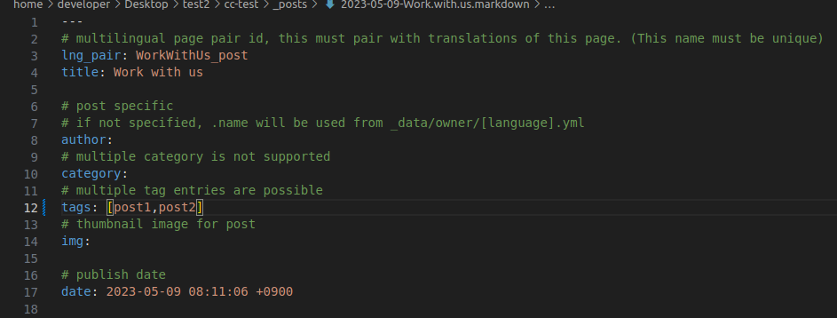
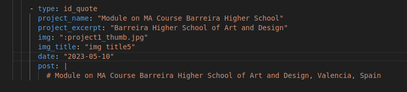
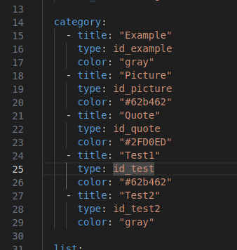

#### 1. Posts Creation

If you want to create a post you should create a file in _posts, the file name structure need to be YYYY-MM-DD-name-of-the-post.md

This is what  we need to add to our new post:

- **lng_pair:** name_id (an id to link the same post in another language, you will need to use the same, at the post to link in another language)
- **title:** title (is the title it will appear into the post)
- **author:** author_name (the name author of this post, if you don't use this, it will appear one automatically)
- **category:** name (a category to link the post, if it doesn't exist it creates automatically)
- **tags:** [tag1,tag2] (tags to be shown at “Tags” into blog, you can add as many tags as you like)
- **img:** “:img-name.extension” (If you want to add a preview image for the post, you need to add the image at: /assets/img/posts)
- **date:** y-m-d h:m:s +GMT (the publishing date it will appear)
- Below this configuration you add the post content, you can write it like the [syntax as md or markdown files](./Syntax-md-files.md)

If you want to create the post in more languages you should go to the language folder wanted, and now into _posts, and now do the same as above

#### 2. Project Creation

For adding more projects to the page you should go to:

_data/content/projects/

Projects information are different depending on what language you are, if you want to add a new project only in english you should go to:

en.yml

Here is the syntax for creating a project, you need to add these lines at the end of the file

- **type:** here you add the “category” it will be, it needs to be the same name as the type of the category you want (we’ll see how to add new categories below)
- **project_name:** is the title of the project
- **project_excerpt:** is like a subtitle(it's used for client name)
- **img:** the image to be shown
- **img_title:** a description/name for the image
- **date:** date to be shown (posted at)
- **post:** the content of the project, follows the same [syntax as md or markdown files](./Syntax-md-files.md)

#### 3. Categories Creation

In the same file as above at the line 14 you can add the categories (categories will be shown at the top of the projects page, the purpose of these buttons is to move you to the content that is linked to the category)

- **title:** this is the name to be shown at the buttons
- **type:** is the id to link with “type” at the project post(it needs to be the same)
- **color:** here you can select the colour for the button, you can put colours name or the hexadecimal code of the colour(you can search the hexadecimal colour by searching “colour picker” at Google)
