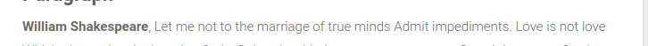
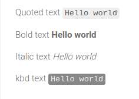
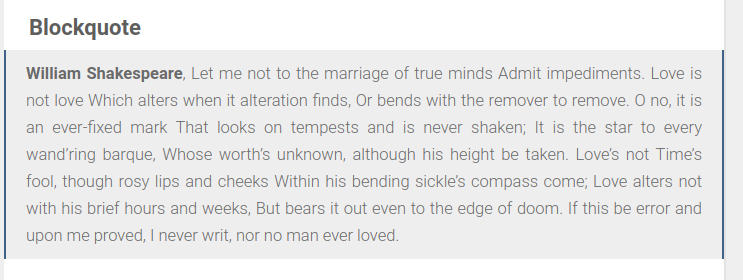
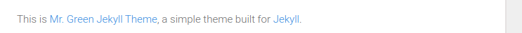
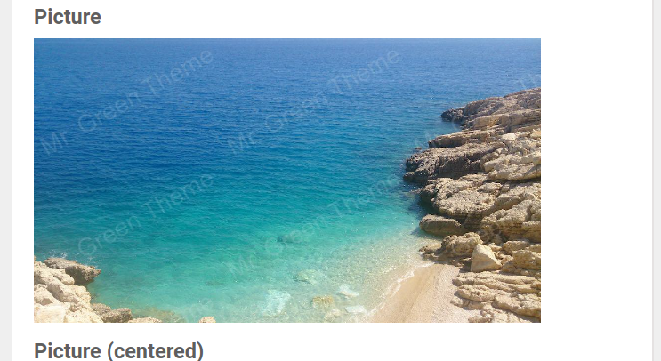
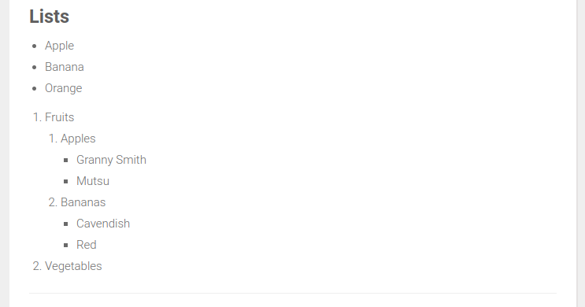

In the files with .md or .markdown extension you can use multiple things to write the text differently, in this document we'll see how to modify this text like a plain text, without html.

### Warning

If any of these mark don't work maybe you need to add an empty line above or below

### Text bold and bigger (like tag h1, h2, etc.)

At the file:

    # Heading 1

    ## Heading 2

    ### Heading 3

    #### Heading 4

    ##### Heading 5

    ###### Heading 6

The # is for making the text larger and bold, if you add more # it will be smaller.

### Bold text inside a line (like tag b)

At the file:

    **William Shakespeare**, Let me not to the marriage of true minds

    For bolding some text you need to put it between **text here**

### Cursive, quoted and dark quotes texts

At the file:

    Quoted text `Hello world`

    Bold text **Hello world**

    Italic text _Hello world_

    kbd text <kbd>Hello world</kbd>

    -For quoting text you can do it adding text between  `text here`
    -Cursive text should be between _text here_
    -Dark quote should be between  <kbd>text here </kbd>

### Blockquote

At the file:

	#### Blockquote
        > **William Shakespeare**, Let me not to the marriage of true minds
        Admit impediments. Love is not love
        Which alters when it alteration finds,
        Or bends with the remover to remove.
        O no, it is an ever-fixed mark
        That looks on tempests and is never shaken;
        It is the star to every wand'ring barque,
        Whose worth's unknown, although his height be taken.
        Love's not Time's fool, though rosy lips and cheeks
        Within his bending sickle's compass come;
        Love alters not with his brief hours and weeks,
        But bears it out even to the edge of doom.
        If this be error and upon me proved,
        I never writ, nor no man ever loved.

For making the blockquote you should add > at the start of the text

### Adding links

At the file:

    This is [Mr. Green Jekyll Theme] (https://github.com/MrGreensWorkshop/MrGreen-JekyllTheme), a simple theme built for [Jekyll](https://jekyllrb.com/).

    -For adding a link you should add the text for linking [text here](link here)
    -If you want to redirect to a page of your website you can link like that [text here](/tabs/about.html)

### Adding pictures(like tag img)

At the file:

 	

    You should [a description/name for the image](:image-name.jpg)
    The image should be at the path /assets/img/projects
    You can also put a absolute path like:
	[a description/name for the image] (/assets/img/projects/image-name.jpg)

### Lists creation(like tags ul, ol, li)

At the file:

    - Apple
    - Banana
    - Orange

    1. Fruits
        1. Apples
            - Granny Smith
            - Mutsu
        1. Bananas
            - Cavendish
            - Red
    1. Vegetables

If you want an unlisted list you need to make it with -
If you want a listed one you should add the number 1.
	After adding the “-” or “1.-” you need to add an empty space like “- text” or “1. Text”

